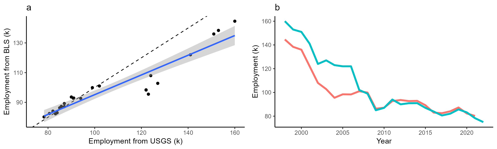

# Iron and steel industry employment in the U.S.
The following describes historical data on employment and activity (e.g., production, capacity) for the iron and steel industry used to derive employment factors.

## Data Sources
*The U.S. Bureau of Labor Statistics (BLS)* 

It reports annual, county- and state-level employment1. Specifically, we collect data for the year 2022 for iron and steel mills and ferroalloy manufacturing, which is categorized under the North American Industry Classification System (NAICS) code 3311. While the data allow for regional analysis of employment trends, some county-level data are not reported to preserve confidentiality, which has implications for deriving employment factors.

*The Mineral Commodity Summaries of the United States Geological Survey (USGS)* 

It report annual, national-level employment in the iron and steel industry2. Particularly, we collect data from 1998 to 2022, including the value of produced raw steel [in real reporting year United States dollars (USD)] the number of companies and mills involved in production, production capacity [million metric tons (MMT)], production volumes [million metric tons (MMT)] by technologies including Basic Oxygen Furnace (BOF) and Electric Arc Furnace (EAF), and annual average of monthly employment for the iron and steel industry. The USGS collects data from various sources, such as production and shipment data from the American Iron and Steel Institute and employment data from the BLS. 

*The Global Energy Monitor (GEM)* 

It reports annual, facility-level employment3. We collect data for 2022, including plant location, operating status, workforce size, ownership, process technology, and steel production capacity [thousand tonnes per annum (TTPA)]. The GEM dataset provides a more granular view of the industry, and includes data for plants with capacities exceeding 0.5 MMT. GEM data are based on publicly available sources like government reports, company filings, news articles, and regulatory filings. However, these data required substantial cleaning, cross-referencing, and overall quality control, given concerns regarding data sources, collection methods, reporting accuracy, timeliness, and regional differences (compared to other data sources).

*The Facility Level Information on Greenhouse Gases Tool (FLIGHT) from the U.S. Environmental Protection Agency (EPA)* 

It supplements plant identification by providing additional information on emissions, fuel types, and locations of iron and steel mill plants. 

Each dataset offers unique insights, with the USGS, BLS, and GEM datasets reported at the national-, regional-, and plant-levels, respectively. By combining these datasets, we better triangulate employment in the U.S. iron and steel industry, and in part address some of the limitations of each dataset (e.g., missing and reported data). To ensure the accuracy and consistency of our data, we compare the employment and activity data across datasets. We find that national steel capacity based on the GEM dataset is approximately 7% higher than those from USGS, despite GEM excluding smaller steel mills.

*Comparison of annual employment from 1998 to 2022 reported by USGS and BLS. Each point represents reported employment data, and the blue line and shaded region are the mean and standard deviation based on simple linear regression (a). The dotted line is the identity line. The  red and blue lines represent BLS and USGS data, respectively (b).*

## File Descriptions
`data.R`: This script executes the code for running libaries and generating data for figures and analyses.

`code.R`: This script executes the code for generating figures and conducting analyses.

## Data Descriptions
`data.Rdata`: Contains national employment data (`capa`) and state-level employment data (`labr`) on an annual basis.

`Global-Steel-Plant-Tracker-2023-03-2.xlsx`: This dataset from GEM can be found [here](https://globalenergymonitor.org/projects/global-steel-plant-tracker/tracker-map/).

`steel_iron_facility.csv`: A compilation of individual iron and steel plant facilities, generated by merging data from GEM and the FLIGHT tool.

